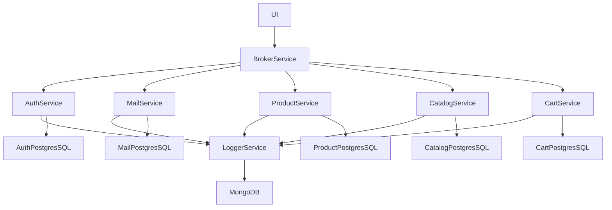

# E-Commerce Microservices with Golang

This is a project just for hobby

## Service Diagram

This is a service diagram. These are services planned to be implemented



## UI

All UI components will be here and served by Fiber. So, you need to run it using this command

### Running

```
cd ui

make build-run
```

## Broker Service

This is just a basic broker service for now. There are two endpoints, one is optional.

### services.json

This is a file that contains other microservices and their configs. It's placed in the root folder

### Registered Routes

- GET: `/` -> Returns JSON for index
- GET: `/api/users` -> Returns all users
- GET: `/api/users/:id` -> Returns a single user by id
- GET: `/ping` -> Returns 200 and text/plain result. This route works when you use `HeartBeat` middleware.

### Routes

Routes can be found under the `routes` folder. `routes.go` file contains middleware configs and handlers. Routes use these handlers.

### Middleware

All middleware can be found under the `middleware` folder. I created a middleware to demonstrate how you can create your own. Shortly, this middleware adds an ability to show service status. It would be necessary If you use a health check service and need to know your service's status.

### Running

```
cd broker-service

make build-run
```

## Auth Service

This is an authentication service for now. There are three endpoints, one is optional.

### Registered Routes

- POST: `/api/v1/auth` -> User login route
- GET: `/api/v1/users` -> Returns all users
- GET: `/api/v1/users/:id` -> Returns single user
- POST: `/api/v1/users` -> Creates a new user
- PUT: `/api/v1/users` -> Updates an existing user
- DELETE: `/api/v1/users` -> Soft delete an existing user
- GET: `/ping` -> Returns 200 and text/plain result. This route works when you use `HeartBeat` middleware.

### Routes

Routes can be found under the `routes` folder. `routes.go` file contains middleware configs and handlers. Routes use these handlers.

### Middleware

All middleware can be found under the `middleware` folder. I created a middleware to demonstrate how you can create your own. Shortly, this middleware adds an ability to show service status. It would be necessary If you use a health check service and need to know your service's status.

### Models

All model files can be found under the `models` folder. There are already two models called `models` and `response_models`

The first one is holding data from database and the second one will use for http responses

### Repository

You can find repository files in this folder. All repository files should only have database operations, nothing else.

I'm not sure about that should we create a logic folder to separate logic from routes? Aren't handlers for this?

### Running

```
cd auth-service

make build-run
```

## scripts

Docker-related files and others can be found in this folder. I've tried to separate this folder to avoid repeating processes such as docker-compose, database images, .etc


## TODO

There are things to be completed. I should be documented each service. If I do this, I can explain everything to anyone without interaction. (I believe that).

These are the things I should be completed! And, more will become.

- [ ] UI Service
- [ ] Broker Service
- [ ] Auth Service
  - [ ] PostgresSQL Connection
  - [ ] Logger Service Connection
- [ ] Logger Service
  - [ ] MongoDB Connection
- [ ] Mail Service
- [ ] Product Service
- [ ] Catalog Service
- [ ] Cart Service
- [ ] Unit Tests
- [ ] Service Documentation

## Notes

Hi there! I'm not good at microservices and golang. This is my first experience. Please give me your ideas. I'm open to new ideas.